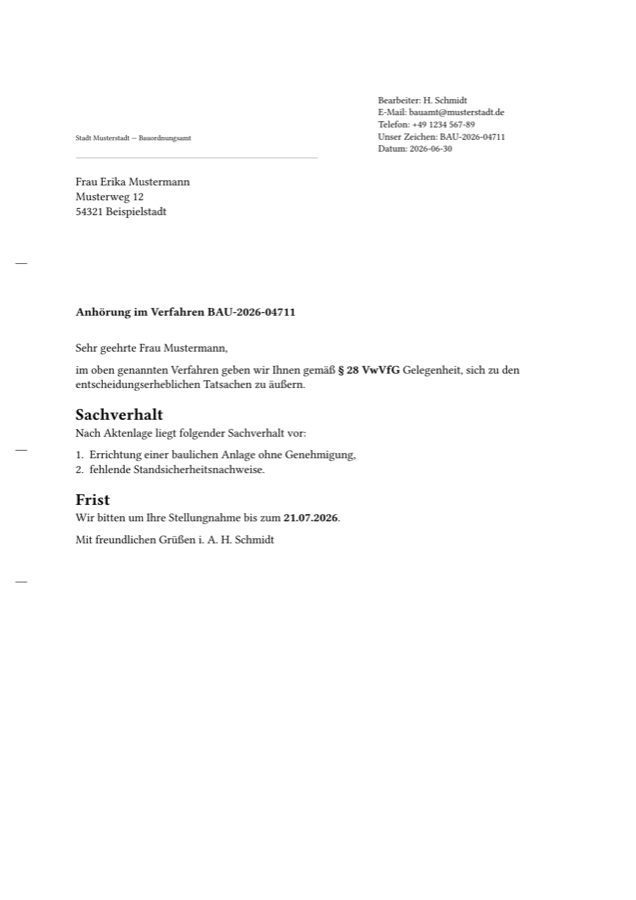

# symaira-print

[](https://github.com/danieljustus/symaira-print/actions/workflows/ci.yml)
[](LICENSE)
[](go.mod)
[](https://github.com/danieljustus/symaira-print/releases/latest)

Turn **Markdown into beautiful PDFs** via named use-case profiles — so humans,
CLIs, and AI agents (MCP) get consistent, predictable output **without the
pandoc/LaTeX iteration pain**. Binary name: `symprint`. Part of the Symaira
ecosystem.

> You write semantic Markdown + a small frontmatter contract. The **profile**
> owns every visual decision (colours, heading sizes, cover page, page numbers,
> DIN 5008 geometry, PDF/A + PDF/UA). What you write is what you get.



*Output of `symprint render examples/behoerde.md -o anhoerung.pdf` — DIN 5008
layout, PDF/A-2a + PDF/UA-1, rendered with the `behoerde` profile.*

```
$ symprint render brief.md
✓ brief.pdf
  profile brief · engine typst 0.15.0 · PDF (tagged) · 42.3 kB · 180 ms

$ symprint render anhoerung.md -p behoerde
✓ anhoerung.pdf
  profile behoerde · engine typst 0.15.0 · PDF/A-2A+UA-1 · 38.7 kB · 195 ms

$ symprint validate report.md
✓ valid for profile "report"
```

## Why symprint

- **Profiles, not knobs.** Pick `brief`, `behoerde`, `report`, or `rechnung`.
  The profile fixes the look; the document stays clean.
- **One engine, no TeX Live.** Renders with [Typst](https://typst.app) — a
  single Apache-2.0 binary reached over `PATH`. symprint itself stays a single
  CGO-free Go binary.
- **Behörde-grade output.** The `behoerde` profile emits **PDF/A-2a + PDF/UA-1**
  (tagged, accessible, archivable) in one step and *fails closed* if the
  document isn't accessible — exactly what E-Government / BITV 2.0 needs.
- **DIN 5008 letters.** `brief` and `behoerde` lay out the Anschriftfeld,
  Infoblock, and fold/hole marks for window envelopes.
- **Strict, discoverable contract.** Unknown frontmatter keys are rejected, so
  typos fail loudly instead of silently changing output.
- **Reproducible.** `--reproducible` yields byte-identical PDFs.
- **MCP server for AI agents** — `render_pdf`, `list_profiles`,
  `validate_document`, `doctor` over stdio.

## Status

This is an early **scaffold** (v0.1.0). What works today, verified
end-to-end against Typst 0.15.0:

- The full Go pipeline: strict frontmatter contract, profile registry,
  validation, engine detection, Typst shell-out, reproducible output.
- CLI: `render`, `profiles`, `validate`, `doctor`, `config`, `mcp`, `version`.
- MCP stdio server with four tools.
- All four profiles render. `report` produces cover + TOC + headers + page
  numbers; `behoerde` produces a verified **PDF/A-2a + PDF/UA-1** file
  (`pdfaid` + `pdfuaid` + `StructTreeRoot` present).
- DIN 5008 letter geometry validated against KOMA-Script (LPPL) source values.
- `veraPDF` CI gating validates PDF/A-2a + PDF/UA-1 conformance on every push/PR.
- Brand fonts (Inter) embedded via `go:embed` for machine-independent output.

What is **not** done yet (see [docs/architecture.md](docs/architecture.md)):

- The `rechnung` VAT/GiroCode logic (currently a scaffold).
- More profiles, and the pandoc/WeasyPrint fallback paths, are roadmap items.

## Install

```bash
# From source
git clone https://github.com/danieljustus/symaira-print.git
cd symaira-print
make build              # → ./symprint (CGO_ENABLED=0)

# Engine (required for rendering)
brew install typst      # macOS
# Windows: winget install --id Typst.Typst
# Cross-platform: cargo install typst-cli

./symprint doctor       # checks typst + optional tools
```

After the first release, install via Go or Homebrew:

```bash
go install github.com/danieljustus/symaira-print/cmd/symprint@latest
brew install danieljustus/tap/symprint
```

## Quick start

```bash
# 1. Write a document (frontmatter selects the profile)
cat > brief.md <<'EOF'
---
profile: brief
date: 30.06.2026
recipient:
  name: "Firma Beispiel GmbH"
  address: ["Industrieweg 7", "54321 Ort"]
betreff: "Angebot Nr. 2026-1"
---
Sehr geehrte Damen und Herren,

vielen Dank für Ihre Anfrage …
EOF

# 2. Render
symprint render brief.md                 # → brief.pdf
symprint render anhoerung.md -p behoerde # PDF/A-2a + PDF/UA-1
symprint validate report.md              # check the contract without rendering
symprint profiles                        # list profiles + guarantees
```

See [`examples/`](examples/) for one document per profile.

## CLI commands

```bash
symprint render <input.md>        # render Markdown to PDF
symprint validate <input.md>      # validate the frontmatter contract
symprint profiles [name]          # list profiles or inspect one profile
symprint doctor                   # check typst, pandoc, and veraPDF availability
symprint config init              # write ~/.config/symprint/config.toml
symprint config path              # print the active config path
symprint mcp                      # start the stdio JSON-RPC server
symprint version                  # print the injected version
```

Global `--json` emits machine-readable output where supported.

## Profiles

| Profile    | Use case                         | Output guarantees                        |
|------------|----------------------------------|------------------------------------------|
| `brief`    | DIN 5008 letter (Form B)         | tagged PDF                                |
| `behoerde` | Authority letter (DIN 5008 Form A) | **PDF/A-2a + PDF/UA-1**, DIN window      |
| `report`   | Report with cover + TOC          | tagged PDF, themed headings, page numbers |
| `rechnung` | German invoice (data-driven)     | tagged PDF (scaffold)                    |

Full reference: [docs/profiles.md](docs/profiles.md) ·
contract: [docs/markdown-contract.md](docs/markdown-contract.md).

## For AI agents (MCP)

```bash
symprint mcp            # stdio JSON-RPC 2.0 server
```

Tools: `render_pdf(markdown, output_path, [profile], [pdf_standard], [reproducible])`,
`list_profiles()`, `validate_document(markdown, [profile])`, `doctor()`.
All logs go to stderr; stdout carries only protocol messages.

## Configuration

Configuration follows XDG and environment-variable conventions:

- file: `~/.config/symprint/config.toml`
- prefix: `SYMPRINT_*`
- defaults: profile `report`, `typst` resolved from `PATH`

Create a starter file with `symprint config init`. CLI flags and MCP arguments
always win over config defaults.

## Architecture

`symprint` is a thin Go CLI/MCP shell around a typesetting engine:

```
Markdown + frontmatter ─▶ internal/press ─▶ Typst (PATH) ─▶ PDF
                          │  contract       │  cmarker (MD→Typst, in-engine)
                          │  profiles       │  --pdf-standard a-2a,ua-1
                          │  validation     └  SOURCE_DATE_EPOCH (reproducible)
                          └─ engine detect + graceful fallback
```

Design rationale, the engine decision (Typst vs pandoc/LaTeX vs CSS), and the
phased roadmap are in **[docs/architecture.md](docs/architecture.md)**.

## Development

```bash
make build        # build ./symprint
make test         # go test ./...
make test-race    # race detector
make lint         # go fmt + go vet
make examples     # render example PDFs; requires typst on PATH
```

The public core intentionally contains no Cloud/Pro/billing code. Keep the
rendering pipeline standalone-first: Typst is executed from `PATH`, not bundled
or linked.

## License

Apache-2.0 (see [LICENSE](LICENSE) and [NOTICE](NOTICE)). The Typst engine is
not bundled; it is installed separately and is itself Apache-2.0.
